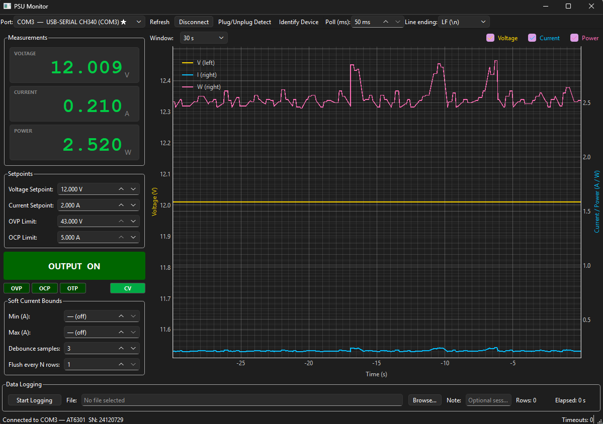

# PSU Monitor

A Python desktop GUI for controlling and monitoring a **single-channel DC bench power supply** over USB Serial (SCPI protocol).



## Features

- **Real-time measurements** — voltage, current, and power with large colour-coded readouts (green / amber / red)
- **Full output control** — voltage/current setpoints, OVP/OCP limits, output on/off toggle
- **Rolling chart** — pyqtgraph dual-axis plot (V on left, I+W on right) with configurable window (30 s – 10 min)
- **Smart port detection**
  - Manual port selection with CH340 highlighted
  - Plug/unplug detection wizard
  - `*IDN?` validation and device identity saved for future auto-connect
  - Auto-connect to last known device on startup
- **Soft-bounds current monitoring** — configurable min/max with debounce, non-modal amber warning banner
- **Data logging** — tab-separated CSV with ISO timestamps, flushed every row (configurable)
- **Persistent config** — window geometry, port, poll rate, line endings, chart window, and bounds all saved across sessions

## Requirements

| Dependency | Minimum version |
|------------|----------------|
| Python | 3.11 |
| PySide6 | 6.7 |
| pyqtgraph | 0.13.7 |
| pyserial | 3.5 |
| numpy | 1.26 |
| platformdirs | 4.2 |

> **Windows users:** Install the CH340 driver from the chip manufacturer before connecting the PSU.  
> Download: <https://www.wch-ic.com/downloads/CH341SER_EXE.html>  
> The device will appear as `USB-SERIAL CH340 (COMx)` in Device Manager.

## Installation

This project uses [**uv**](https://github.com/astral-sh/uv) for dependency and environment management.

```bash
# Install uv if you don't have it
curl -LsSf https://astral.sh/uv/install.sh | sh   # macOS / Linux
# or: winget install --id=astral-sh.uv             # Windows

# Clone and enter the project directory
git clone https://github.com/yourname/psu-monitor.git
cd psu-monitor

# Create virtual environment and install all dependencies
uv sync
```

## Running

```bash
uv run python -m psu_monitor
```

Or, after `uv sync`, the installed script entry point also works:

```bash
uv run psu-monitor
```

## Usage

### Connecting

1. **Manual** — Select the port from the dropdown (CH340 ports are marked with ★) and click **Connect**.
2. **Plug/Unplug** — Click **Plug/Unplug Detect**, follow the prompts to unplug then re-plug the USB cable. The port is identified automatically.
3. **Identify Device** — Select a port and click **Identify Device** to send `*IDN?` and confirm the device responds correctly. The device identity is saved for future auto-connect.

### Controls

| Control | Description |
|---------|-------------|
| Voltage Setpoint | Send `VOLT <v>` — sets output voltage |
| Current Setpoint | Send `CURR <a>` — sets current limit |
| OVP Limit | Send `VOLT:LIM <v>` — overvoltage protection threshold |
| OCP Limit | Send `CURR:LIM <a>` — overcurrent protection threshold |
| OUTPUT ON / OFF | Send `OUTP ON` / `OUTP OFF` |

Press **Enter** or click away after editing a setpoint spinbox to send the command.

### Soft-bounds warning

In the **Soft Current Bounds** panel, set an expected current range (min / max in amps). If the measured current stays outside this range for *N* consecutive samples (debounce), an amber warning banner appears. It automatically clears when current returns to the normal range. Out-of-bounds trigger events are written to the active log file.

### Data logging

Click **Browse…** to choose a log file, optionally enter a session note, then click **Start Logging**. The log is a tab-delimited text file with the schema:

```
timestamp_iso  elapsed_s  voltage_v  current_a  power_w
voltage_set    current_set  output_on  mode
ovp_fault      ocp_fault    otp_fault  note
```

The file is flushed on every row by default (configurable in the settings panel).

## Serial communication details

| Parameter | Value |
|-----------|-------|
| Baud rate | 115200 |
| Data bits | 8 |
| Parity | None |
| Stop bits | 1 |
| Flow control | None |
| Default line ending | LF (`\n`) |
| Timeout | 1 s per command |

The key polling command is `MEAS:ALL:INFO?` which returns all measurements and fault status in a single round-trip. Refer to your supply's programming manual for the full SCPI command set.

> **Note:** A copy of the programming manual used during development is included in `docs/`. Treat it as a starting point — several details (field delimiters, response formats) had to be verified experimentally and differ from what the manual describes.

## Project layout

```
psu_monitor/
├── pyproject.toml
├── README.md
└── src/
    └── psu_monitor/
        ├── main.py            # Entry point
        ├── app_window.py      # Main window, layout, widget wiring
        ├── serial_worker.py   # QThread poll loop and command queue
        ├── psu_driver.py      # SCPI command abstractions
        ├── port_detector.py   # Port enumeration and CH340 detection
        ├── data_logger.py     # Tab-delimited CSV logging
        ├── config.py          # JSON config via platformdirs
        ├── constants.py       # All user-facing strings
        └── widgets/
            ├── gauges.py          # Large numeric readouts
            ├── plot_widget.py     # pyqtgraph rolling chart
            ├── warning_panel.py   # LED indicators and soft-bounds banner
            └── settings_panel.py  # Bounds, debounce, flush settings
```

## Development

```bash
# Lint
uv run ruff check src/

# Format
uv run ruff format src/
```

## License

MIT
